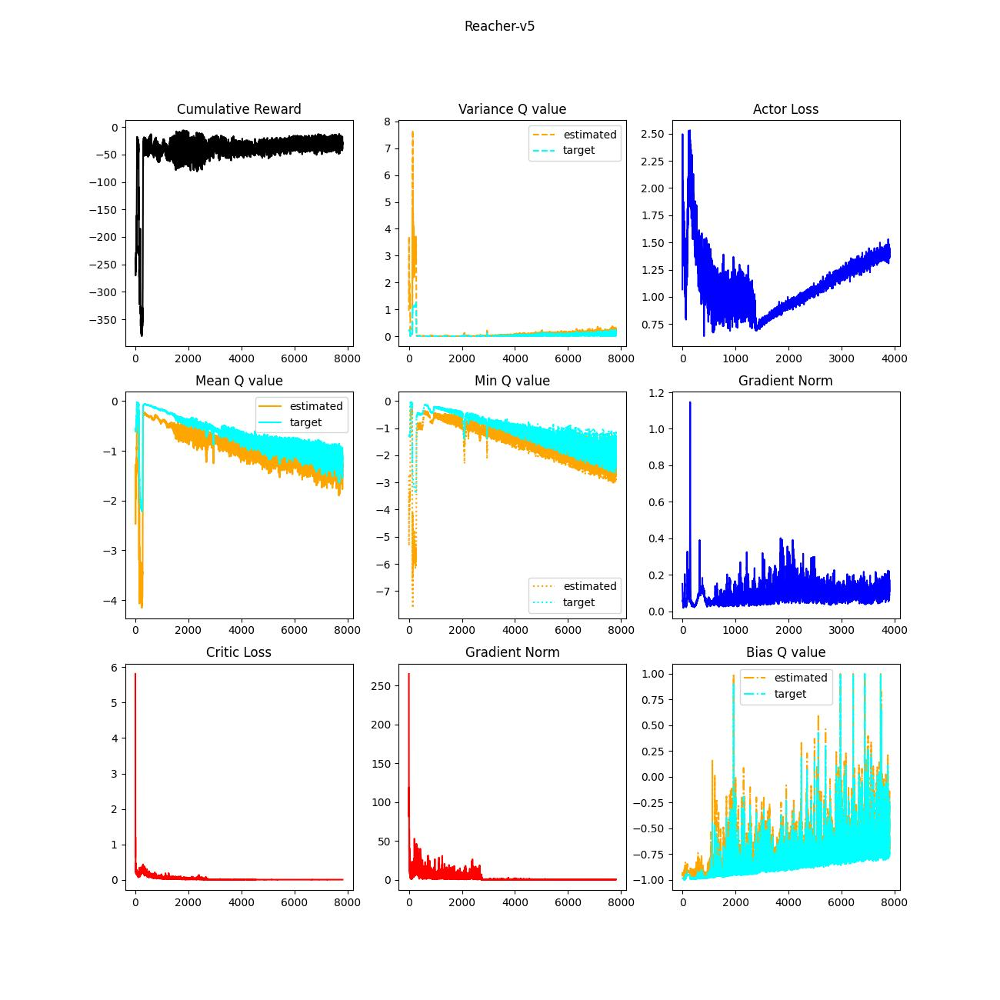

# IronHeart

In this project, several representatives of modern RL approaches, especially deep learning-based, will be addressed. The learning capability is examined in "simple" Mujoco environments: InvertedPendulum-v5, Reacher-v5, and Hopper-v5. The objectives are as follows.

1. Brief taxonomy & chronicle
2. The strategies and the implications
3. "NAIVE" implementation based on the paper from scratch
4. Experiements
5. How to improve

Here, **"NAIVE" implementation** means following the learning strategy presented in the paper **without trick**. Sometimes authors don't reveal their full approach, which can lead to "exaggerated" performance unintentionally. I believe, it also helps to understand fundamental problems beneath modern RL algorithms. Please note that x axis indicates epochs therefore the batch size should be multiplied to represent them as steps. The robust evaluation should be done statistically rather than one-shot measurement. The experiments were not repeated multiple times. Thus, please do not jump to the conclusion based on these results.  

## Deep Deterministic Policy Gradient (DDPG)

### Taxonomy

| Type        | Training Policy | Execution Policy | Sampling | Remark |
|-------------|-----------------|-------------|---------------|-------|
| Off-policy  | Deterministic + Noise  | Deterministic |   .    | Target Network|

### History

Deterministic Policy Gradient (DPG) → DDPG

### Key Elements

1. Artificial noise to actions for exploration steps
2. Temporal difference (TD) correction through bootstrapping
3. Target networks
4. Polyak updates of the targets
5. L2 regularization (in Adam optimizer)

The essence of DDPG is target networks which allows stable updates of the weights. It bootstraps Q-values via TD correction to train the current cirtic network. Due to off-policy nature, the stacked data in the replay buffer would cotain high variance, which leads to instability. The target networks take account of small portion of the current networks as updates so that it achieves stable improvements. In other words, the target networks correct TD-corrected values: it can mitigate the intrinsic variance coming from old policies.

### Experiments
Followings are results of the experiments. Note that employed hyper-parameters including model architectures of each experiment are identical (you can find better hyper-parameters). Q values from the targets (cyan) are more stabilized than the one from the current networks. Bias is measured using Monte-Carlo (MC) return and is normalized. The value is clipped between -1 and 1. The agent in Reacher-v5 shows better behaviors. As the cumulative reward converges, mean, variance and minimum of Q values are also converging. Critic loss, however, seems to contain risk of instability because the gradient norm is rather high. Besides, bias is totally in chaos...

On the other hand, the rest of the environments deliver (tooooo) unstable behaviors. Critic loss of each env collapses in the middle of the training:it cannot estimate the values properly. This fact implies, the critic deceives the actor that belives make a best decision-making.

### Discussion
DDPG needs well-tuned hyper-paarameters as well as a couple of training tricks such that 

1. Gradient clipping
2. Prioritized replay buffer & fill the buffer before starting training
3. Layer normalization (like batchnorm, layernorm, etc)

to stabilize the learning procedure. Along with learning instability, overestimation is another main defect of DDPG. Then, what are the lessons from DDPG approach? In my opinion, we should look at 

1. Data distribution in the replay buffer
2. Statistical meaning of "parsing trajectories"

In case 2, critic samples data points with batch size and each of them belongs to different (or same) sequences that is generated from old policies. Target critic might not be safe enough to guard against the variance coming from policy discrepancy. Well, it needs more analytic investigation. 

## Twin Delayed Deep Deterministic Policy Gradient (TD3)

### Taxonomy

| Type        | Training Policy | Execution Policy | Sampling | Remark |
|-------------|-----------------|-------------|---------------|-------|
| Off-policy  | Deterministic + Noise | Deterministic | . | Twin Critics, Delayed Updates|

### History

DPG → DDPG → TD3

### Key Elements

1. Artificial noise to actions for exploration steps
2. TD correction through bootstrapping
3. Twin critics (of course twin target critics as well)
4. Polyak updates of the targets
5. Policy smoothing
6. Delayed updates of the targets and an actor

TD3 is an improved version of DDPG, it mainly deals with overestimation bias problem. Though the proof in TD3 assumes theoretical cricumstance, it clearly shows that even actor-critic in deteministic approach can gurantee overestimation. TD3 compares Q values from two different critics and choose a smaller one to mitigate the exaggeration. It definitely stabilize learning procedure but I still have a question mark if it "significantly" improve the optimization capability.

### Experiments
I agree that it can stabilize the learning process (if we set $\tau$ same as DDPG) because the instability of the critic networks is dramatically reduced. It still, however, struggles to find the optimum behaviors. 

## Soft Actor-Critic (SAC)

DPG → DDPG → TD3 → SAC

### Taxonomy

### History

### Key Elements

### Experiments

## Proximal Policy Optimization (PPO)

### Taxonomy

### History

Conservative Policy Ieteration (CPI) → Trusted Region Policy Optimization (TRPO) → PPO

### Key Elements

### Experiments

## Asynchronous Advantage Actor-Critic (A3C)

### Taxonomy

### History

Advantage Actor-Critic (A2C) → A3C

### Key Elements

### Experiments

## Importance-Weighted Actor-Learner Architecture (IMPALA)

### Taxonomy

### History

A2C → A3C → GPU A3C (GA3C) → IMPALA

### Key Elements

### Experiments