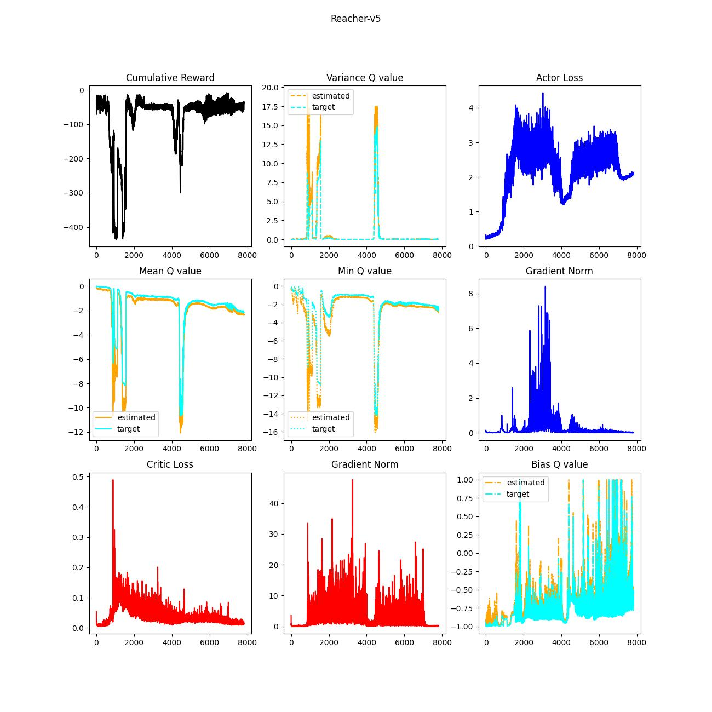
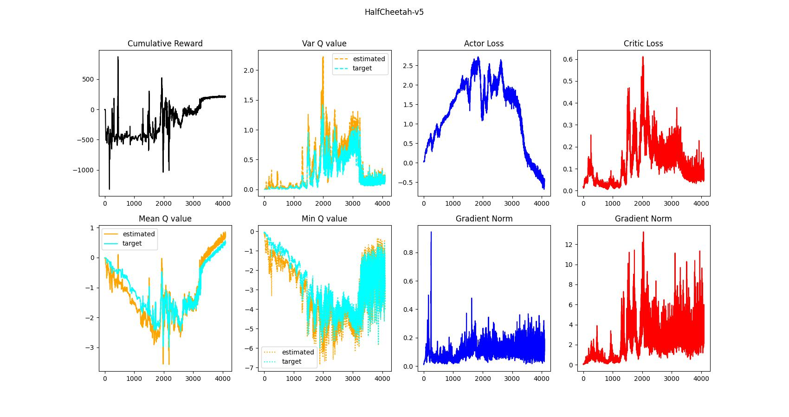

# IronHeart

In this project, several representatives of modern RL approaches, especially deep learning-based, will be addressed. The learning capability is examined in Mujoco environments which contain continuous action and state space: InvertedPendulum-v5, Reacher-v5, and HalfCheetah-v5. The objectives are as follows.

1. Brief taxonomy
2. The strategies and the implications
3. Implementation from scratch

## Deep Deterministic Policy Gradient (DDPG)

| Type        | Training Policy | Execution Policy | Sampling | Remark |
|-------------|-----------------|-------------|---------------|-------|
| Off-policy  | Deterministic  | Deterministic | Implicit | Target Network|

The essence of DDPG is target networks which allows rather stable updates of the weights. First, it bootstraps Q-values via temporal difference (TD) correction to train the current cirtic network. Due to off-policy nature, the stacked data in the replay buffer would have high variance, it leads to unstable learning. The target networks take account of small portion of the current networks as updates so that it achieves balanced improvements. In other words, the target networks correct TD-corrected values of different policies: it can reduce the intrinsic variance! Followings are results of the experiments. Note that employed hyper-parameters including model architectures of each experiment are identical (you can find better hyper-parameters).

You may notice that the DDPG agent in the simplest environment (Inverted Pendulum) shows collapse into stochastic behaviors. Both Q-values inferred from the critic and the target critic are getting higher variance over time while the means are increasing. Besides, differences between the estimated values and Monte-Carlo returns keep certain level rather than decreasing, which means biased. It would imply overestimation of Q values regarding particular states & actions. But, why does "InvertedPendulum-v5" deliver poor performance among the environments? Maybe, it is too small environment affected by misleading Q values easily. 
