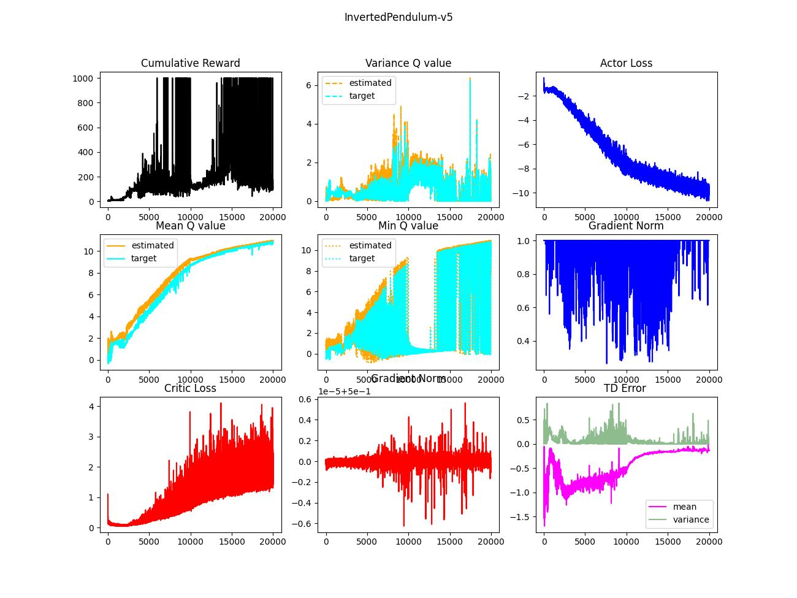
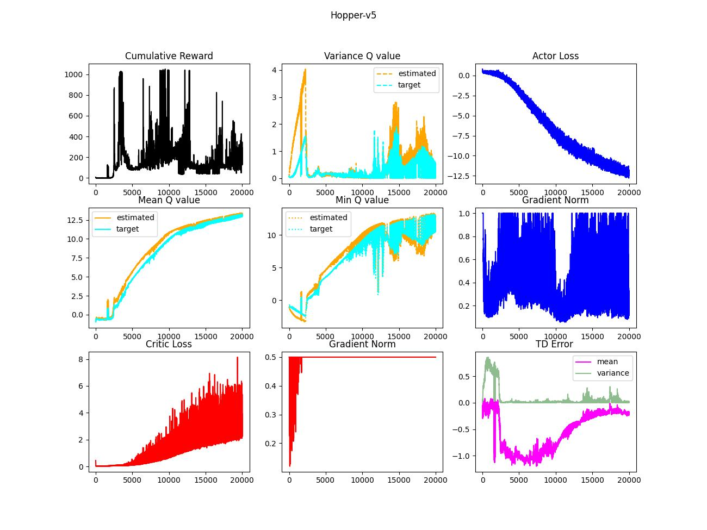

# IronHeart

In this project, several representatives of modern RL approaches, especially deep learning-based, will be addressed. The learning capability is examined in "simple" Mujoco environments sucha s InvertedPendulum-v5, Reacher-v5, or Hopper-v5. The objectives are as follows.

1. Brief taxonomy & chronicle
2. The strategies and the implications
3. (Semi-) "NAIVE" implementation based on the paper from scratch
4. Experiements: 20k ~ 40k learning
5. Discussion

Here, **"NAIVE" implementation** means following the learning strategy presented in the paper **without trick**. Sometimes authors don't reveal their full approach, which can lead to "exaggerated" performance unintentionally. I believe, it also helps to understand fundamental problems beneath modern RL algorithms. The robust evaluation should be done statistically rather than one-shot measurement. The experiments were not repeated multiple times (due to computation time). Besides, the training is done by 40k steps at last, which is not sufficient exploration for the continuous environment. Thus, please do not jump to the conclusion based on these results.  

## Deep Deterministic Policy Gradient (DDPG)

### Taxonomy

| Type        | Training Policy | Execution Policy | Sampling | Remark |
|-------------|-----------------|-------------|---------------|-------|
| Off-policy  | Deterministic | Deterministic |   .    | Target Network|

### History

Deterministic Policy Gradient (DPG) → DDPG

### Key Elements

1. Artificial noise to actions for exploration steps
2. Temporal difference (TD) correction of bootstrapped Q value
3. Target networks
4. Polyak updates of the targets
5. L2 regularization (in Adam optimizer)
6. Replay buffer
7. Step-wise learning

The essence of DDPG is target networks which allows stable updates of the weights. It bootstraps Q-values via TD correction to train the current cirtic network. Due to off-policy nature, the stacked data in the replay buffer would cotain high variance, which leads to instability. The target networks take account of small portion of the current networks as updates so that it achieves stable improvements. In other words, the target networks correct TD-corrected values: it can mitigate the intrinsic variance coming from old policies.

### Experiments
I monitored 9 indicators as a performance measurement: cumulative reward, statistics of Q values, losses, gradient norm, and TD error. It might need to handle the hyperparameters very carefully so that the critic loss is lying on "moderate" range (of course, it would be env-dependent). Note that the critic networks are supervised by "pseudo labels", which are bootstrapped: therefore, the lowest loss definitely not guarantee the best reward. Min Q value also designates instability of critics, it drastically changes between the fool and the wise. But, again, 20k is not enough for full training! 

### Discussion
I added extra techniques to stabilize the critics such that

1. Gradient clipping
2. Orthogonal initialization (only for critics)
3. Layer normalization 
4. L2 regularization in the critic loss
5. Buffer warm-up
6. Learning rate scheduler

Still, it needs more tuning (like hyper-parameters & more training). Researchers (who have trained the agent for 1M steps) point out that it is not sufficient for the practical usages: the critics are too vulnerable. The crucial problem is coming from the credit assignment caused by learning instability. Thus, next improvement should be capable to enhance stability.

## Twin Delayed Deep Deterministic Policy Gradient (TD3)

### Taxonomy

| Type        | Training Policy | Execution Policy | Sampling | Remark |
|-------------|-----------------|-------------|---------------|-------|
| Off-policy  | Deterministic | Deterministic | . | Twin Critics, Delayed Updates|

### History

DPG → DDPG → TD3

### Key Elements

1. Artificial noise to actions for exploration steps
2. TD correction of bootstrapped Q value
3. Twin critics (of course twin target critics as well)
4. Polyak updates of the targets
5. Policy smoothing
6. Delayed updates of the targets and an actor
7. Replay buffer
8. Step-wise learning

TD3 is an improved version of DDPG, it mainly deals with overestimation bias problem. Though the proof in TD3 assumes theoretical cricumstance, it clearly shows that even actor-critic in deteministic approach can lead criticis to overestimation. TD3 compares Q values from two different critics and choose a smaller one to mitigate the exaggeration (vs game solver).

### Experiments
The intended behavior seems to be reflected well into TD error because mean of errors more deviated than the one of DDPG (remember overestimation or it might be early to conclude it). 

### Discussion
As I did in DDPG approach, the implemented TD3 has additional features such that

1. Gradient clipping
2. Orthogonal initialization (only for critics)
3. Layer normalization 
4. Buffer warm-up
5. Learning rate scheduler

TD3 is more stable than DDPG (if $\tau$ is same) but it is not free from the overfit problem, in my opinion. I guess, it is one of intrinsic problems in deterministic approach.  

## Soft Actor-Critic (SAC)

### Taxonomy
| Type        | Training Policy | Execution Policy | Sampling | Remark |
|-------------|-----------------|-------------|---------------|-------|
| Off-policy  | Stochastic | Deterministic | Explicit | Entropy |

### History
DPG → DDPG → TD3 → SAC

### Key Elements
1. Tractable policy distribution: Gaussian 
2. Soft value function
3. TD correction of bootstrapped soft value
4. NO actor target
5. Twin critics (of course twin target critics as well)
6. Temperature that handles exploration (either learnable or constant)
7. Replay buffer
8. Step-wise learning

### Experiments
It was fortunate the SAC agent reaches out optimal convergence in the InvertedPendulum-v5 env within 40k steps. I think overfitting is dramatically mitigated but it might need careful adjustment of the temperature: this factor is highly dependent on the env, so it would be necessary to set it as a learnable parameter in practice.

### Discussion
As I did in DDPG approach, the implemented SAC has additional features such that

1. Gradient clipping
2. Orthogonal initialization (only for critics)
3. Layer normalization 
4. Buffer warm-up

SAC is even better than DDPG and TD3. Apart from the results, the evolution of critic is not intuitive. What does it mean? What is the job of the critics to maximize the cumulative reward?

## Proximal Policy Optimization (PPO)
Please refer to cool report [here](https://github.com/kwpark-dev/RL_toolkits/tree/main)

### Taxonomy
| Type        | Training Policy | Execution Policy | Sampling | Remark |
|-------------|-----------------|-------------|---------------|-------|
| On-policy  | Stochastic | Deterministic | Explicit | Surrogate Objective |

### History

Conservative Policy Ieteration (CPI) → Trusted Region Policy Optimization (TRPO) → PPO

## Importance-Weighted Actor-Learner Architecture (IMPALA)

### Taxonomy
| Type        | Training Policy | Execution Policy | Sampling | Remark |
|-------------|-----------------|-------------|---------------|-------|
| Off-policy  | Stochastic | Deterministic | Implicit | V-trace, Learner Queue |

### History

A2C → A3C → GPU A3C (GA3C) → IMPALA

### Key Elements
1. Implicit action sampling
2. V-trace
3. Batch-wise learning
4. Rollout Buffer
5. Communication with multiple actors

The aim of IMPALA is scalability, it wants to extend the solution to the more complex problem. The essence is V-trace and multi-process. Each process contain different actor updated by lag policy. Because multiple actors explore the environment, the sample efficiency is remarkable. On the other hand, the samples are collected by different policy, therefore training data would have high variance. V-trace is a mean to avoid such a problem. It adjusts TD-corrected values adding discrepancy reduction term.   

### Experiments
The code still has room to be optimized and to fix. It looks very promising for the multi-agent system. Note that the simulation runs only 256 steps as a test.

### Discussion
It has additional features such that

1. Orthogonal initialization (only for critics)
2. Layer normalization 

I believe that IMPALA can allow robust behavior learning through the efficient sampling strategy. For example, if the data is available, server can collect driving data from drivers to train a learner (or learners). Of course, policies of the drivers and the learner is no more coupled each other, it might be more challenging to handle the variance. 