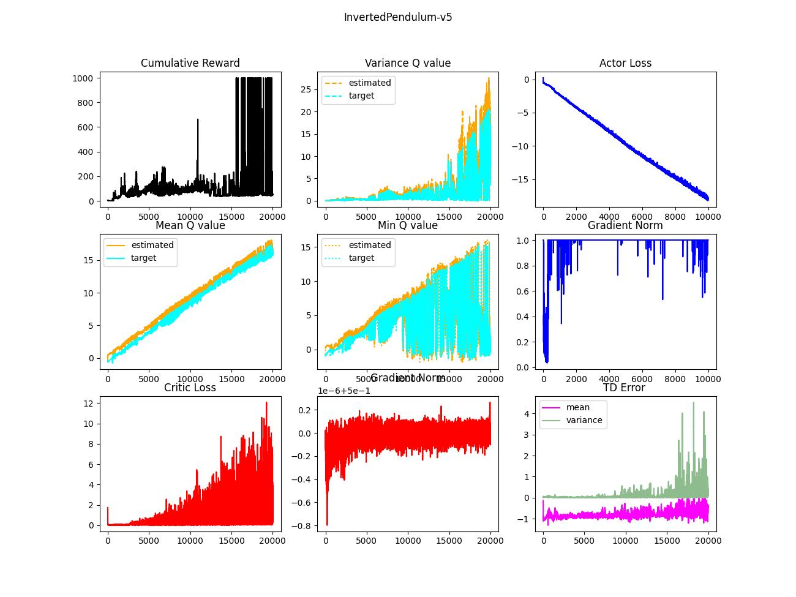

# IronHeart

In this project, several representatives of modern RL approaches, especially deep learning-based, will be addressed. The learning capability is examined in "simple" Mujoco environments sucha s InvertedPendulum-v5, Reacher-v5, or Hopper-v5. The objectives are as follows.

1. Brief taxonomy & chronicle
2. The strategies and the implications
3. (Semi-) "NAIVE" implementation based on the paper from scratch
4. Experiements
5. Discussion

Here, **"NAIVE" implementation** means following the learning strategy presented in the paper **without trick**. Sometimes authors don't reveal their full approach, which can lead to "exaggerated" performance unintentionally. I believe, it also helps to understand fundamental problems beneath modern RL algorithms. The robust evaluation should be done statistically rather than one-shot measurement. The experiments were not repeated multiple times (due to computation time). Thus, please do not jump to the conclusion based on these results.  

## Deep Deterministic Policy Gradient (DDPG)

### Taxonomy

| Type        | Training Policy | Execution Policy | Sampling | Remark |
|-------------|-----------------|-------------|---------------|-------|
| Off-policy  | Deterministic | Deterministic |   .    | Target Network|

### History

Deterministic Policy Gradient (DPG) → DDPG

### Key Elements

1. Artificial noise to actions for exploration steps
2. Temporal difference (TD) correction through bootstrapping
3. Target networks
4. Polyak updates of the targets
5. L2 regularization (in Adam optimizer)
6. Replay buffer
7. Step-wise learning

The essence of DDPG is target networks which allows stable updates of the weights. It bootstraps Q-values via TD correction to train the current cirtic network. Due to off-policy nature, the stacked data in the replay buffer would cotain high variance, which leads to instability. The target networks take account of small portion of the current networks as updates so that it achieves stable improvements. In other words, the target networks correct TD-corrected values: it can mitigate the intrinsic variance coming from old policies.

### Experiments
I monitored 9 indicators as a performance measurement: cumulative reward, statistics of Q values, losses, gradient norm, and TD error. In the experiment, it was exetremely hard to reach out optimal convergence. In case the NAIVE version (the results are not from NAIVE implementation), the critics were easily collapsed. It might need to handle the hyperparameters very carefully so that the critic loss is lying on "moderate" range (of course, it would be env-dependent). Note that the critic networks are supervised by "pseudo labels", which are bootstrapped: therefore, the lowest loss definitely not guarantee the best reward. Min Q value also designates instability of critics, it drastically changes between the fool and the wise. Now, let's look at the cumulative reward. Steps between 15000 and 20000, the agent repeats poor and optimal performance. Statistics of TD error explains what it means: the variance of the error keeps very low level, which implies the estimated values are nearly same. The critic networks overfits to specific states & actions, so once it observes well-known states then it works very well.  

### Discussion
I added extra techniques to stabilize the critics such that

1. Gradient clipping
2. Orthogonal initialization (only for critics)
3. Layer normalization 
4. L2 regularization in the critic loss
5. Buffer warm-up
6. Learning rate scheduler

Still, it needs more tuning (like hyper-parameters & more training). In my opinion, it is not sufficient for the practical usages: the critics are too vulnerable. The crucial problem is coming from the credit assignment caused by learning instability. Thus, next improvement should be capable to enhance stability.

## Twin Delayed Deep Deterministic Policy Gradient (TD3)

### Taxonomy

| Type        | Training Policy | Execution Policy | Sampling | Remark |
|-------------|-----------------|-------------|---------------|-------|
| Off-policy  | Deterministic | Deterministic | . | Twin Critics, Delayed Updates|

### History

DPG → DDPG → TD3

### Key Elements

1. Artificial noise to actions for exploration steps
2. TD correction through bootstrapping
3. Twin critics (of course twin target critics as well)
4. Polyak updates of the targets
5. Policy smoothing
6. Delayed updates of the targets and an actor
7. Replay buffer
8. Step-wise learning

TD3 is an improved version of DDPG, it mainly deals with overestimation bias problem. Though the proof in TD3 assumes theoretical cricumstance, it clearly shows that even actor-critic in deteministic approach can lead criticis to overestimation. TD3 compares Q values from two different critics and choose a smaller one to mitigate the exaggeration (vs game solver). It dramatically stabilize learning procedure but I still have doubts if it "significantly" improve the optimization capability.

### Experiments
I agree that it can stabilize the learning process (if we set $\tau$ same as DDPG) because the instability of the critic networks is dramatically reduced. It still struggles to find the optimum behaviors. Mean Q values keep increasing over steps but its minimum oscillates as DDPG. The intended behavior seems to be reflected well into TD error because mean of errors smaller than the one of DDPG (remember overestimation). The variance wobbles drastically rather than keeping a certain level. It indicates that the model struggles to figure out the generalized value estimation but it seems not successful.

### Discussion
As I did in DDPG approach, the implemented TD3 has additional features such that

1. Gradient clipping
2. Orthogonal initialization (only for critics)
3. Layer normalization 
4. Buffer warm-up
5. Learning rate scheduler

TD3 is more stable than DDPG but it is not free from the overfit problem, in my opinion. I guess, it is one of intrinsic problems in deterministic approach.  

## Soft Actor-Critic (SAC)

DPG → DDPG → TD3 → SAC

### Taxonomy

### History

### Key Elements

### Experiments

## Proximal Policy Optimization (PPO)

### Taxonomy

### History

Conservative Policy Ieteration (CPI) → Trusted Region Policy Optimization (TRPO) → PPO

### Key Elements

### Experiments

## Asynchronous Advantage Actor-Critic (A3C)

### Taxonomy

### History

Advantage Actor-Critic (A2C) → A3C

### Key Elements

### Experiments

## Importance-Weighted Actor-Learner Architecture (IMPALA)

### Taxonomy

### History

A2C → A3C → GPU A3C (GA3C) → IMPALA

### Key Elements

### Experiments